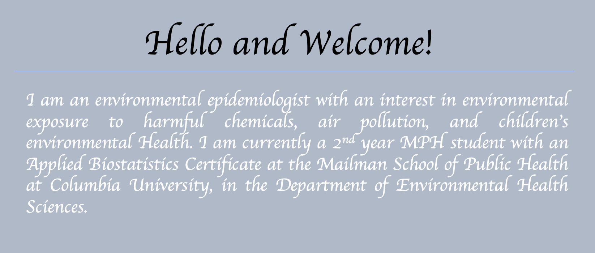

# Shannon Park, 2021 MPH Candidate 

This is Shannon Park, and I am currently a second-year MPH student at Columbia University, majoring in Environmental Health Sciences with the Applied Biostatistics specialization. 

Before I join the MPH program at Columbia, I majored in Chemistry at Ulsan National Institute of Science and Technology (UNIST), Republic of Korea. There, I was inspired to pursue a public health career by awaring the potential health effect of industrial chemicals and exposure to human population through environmental media. With my skills learned at Columbia University and previous wet-lab experience, I want to participate in more research in environmental health science to find an association between pediatric health outcomes and exposure to various chemicals, including plasticizers, endocrine-disrupting chemicals, flame retardants, and air pollution.  

Currently, I'm applying for various phD programs. Ultimately, I want to be an influential environmental epidemiologist and lead the research helping thorough regulation of environmental chemicals for public health. 

